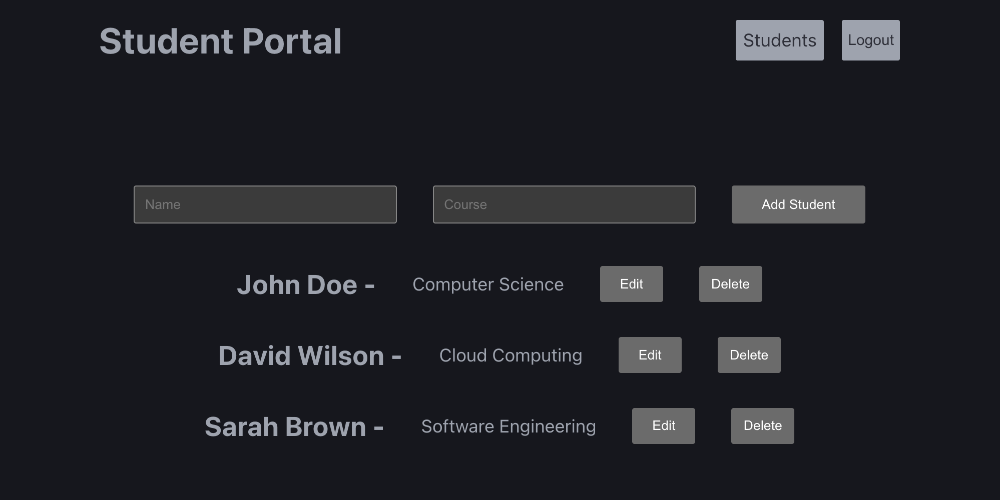
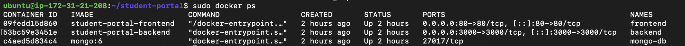
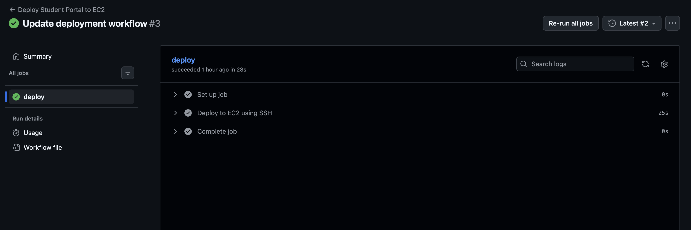

# Student Portal - Dockerized MERN Application with AWS EC2 & GitHub Actions CI/CD

Student Portal is a MERN-based student management system that allows admins to register, authenticate, and manage student records through a secure JWT-protected API.

The application serves as a hands-on project for learning containerization, cloud deployment, and CI/CD workflows.

This project demonstrates how a full-stack MERN application can be containerized, deployed, and automated using Docker, Docker Compose, Nginx, AWS EC2, and GitHub Actions.

---

## Project Purpose

The primary goal of this project wasmto gain hands-on experience with modern deployment and DevOps practices.

This project was used as a practical environment to learn:

- Docker Images and Containers
- Dockerfiles
- Docker Compose
- Multi-Container Applications
- Docker Networking
- Docker Volumes
- Environment Variable Management
- Nginx Production Deployment
- AWS EC2 Hosting
- GitHub Actions
- CI/CD Pipelines
- Automated Deployment Workflows

---

## Live Demo

Application deployed on AWS EC2:

```txt
http://16.176.168.183
```

> Note: The application currently uses an EC2 public IP. The address may change if the instance is restarted.

---

## Application Features

### Authentication

- User Registration
- User Login
- Password Hashing with bcrypt
- JWT Authentication
- Protected Routes

### Student Management

- Add Students
- View Students
- Update Students
- Delete Students

---

## DevOps Features

- Dockerized Frontend
- Dockerized Backend
- Dockerized MongoDB
- Docker Compose Multi-Container Setup
- Persistent Database Storage with Docker Volumes
- Custom Docker Network
- Nginx Production Deployment
- AWS EC2 Hosting
- GitHub Actions CI/CD Pipeline
- Automated Deployments

---

## Architecture

```text
Browser
   ↓
Nginx Container
   ↓
React Frontend

Backend Container
   ↓
MongoDB Container
   ↓
Docker Volume
```

---

## Docker Components

### Containers

```text
frontend
backend
mongo-db
```

### Network

```text
student-network
```

Used for communication between:

- Frontend Container
- Backend Container
- MongoDB Container

### Volume

```text
mongo-data
```

Used for persistent MongoDB storage.

---

## Technology Stack

### Application

- React
- React Router
- Vite
- Node.js
- Express.js
- MongoDB
- Mongoose
- JWT
- bcrypt

### DevOps & Deployment

- Docker
- Docker Compose
- Nginx
- AWS EC2
- GitHub Actions

---

## Local Development

### Backend

```bash
cd server
npm install
npm run dev
```

### Frontend

```bash
cd client
npm install
npm run dev
```

---

## Environment Variables

### Backend

Create a `.env` file inside the `server` directory:

```env
PORT=3000
MONGO_URI=your_mongodb_connection_string
JWT_SECRET=your_secret_key
JWT_EXPIRES=7d
```

### Frontend

Create a `.env` file inside the `client` directory:

```env
VITE_API_URL=http://localhost:3000/api/v1
```

---

## Docker Deployment

Build and run all services:

```bash
docker compose up --build
```

Run containers in detached mode:

```bash
docker compose up -d
```

Stop containers:

```bash
docker compose down
```

---

## Verify Docker Resources

### Containers

```bash
docker ps
```

### Volumes

```bash
docker volume ls
```

### Networks

```bash
docker network ls
```

---

## AWS EC2 Deployment Workflow

Deployment process used in this project:

```text
Create EC2 Instance
        ↓
SSH into Server
        ↓
Install Docker & Docker Compose
        ↓
Clone Repository
        ↓
Configure Environment Variables
        ↓
Run Docker Compose
        ↓
Deploy Application
        ↓
Configure Nginx
        ↓
Expose Application via Port 80
```

---

## CI/CD Pipeline

GitHub Actions automatically deploys the application to AWS EC2.

Deployment workflow:

```text
Developer Push
        ↓
GitHub Actions
        ↓
SSH into EC2
        ↓
Git Pull
        ↓
Docker Compose Build
        ↓
Docker Compose Restart
        ↓
Updated Application
```

---

## Screenshots

### Student Dashboard



### Docker Containers Running on AWS EC2



### GitHub Actions CI/CD Deployment



---

## Future Improvements

- Domain Configuration
- HTTPS with SSL
- Automated Testing
- Monitoring & Logging

---

## Author

Built as a hands-on deployment and DevOps learning project using Docker, AWS EC2, Nginx, and GitHub Actions CI/CD.

# Student Portal MERN Application

A simple full-stack Student Management application built using the MERN stack (MongoDB, Express.js, React, and Node.js).

The application allows users to register, authenticate using JWT, and perform CRUD operations on student records through a secure REST API.

---

## 🎯 Project Purpose

This project is a simple MERN application that serves as a foundation for learning Docker, Docker Compose, CI/CD, GitHub Actions, and cloud deployment concepts.

A Dockerized version of this application is available in the **docker-setup** branch.

---

## ✨ Features

### Authentication

- User Registration
- User Login
- Password Hashing using bcrypt
- JWT Authentication
- Protected Routes

### Student Management

- Add Student
- View Students
- Update Student Details
- Delete Students

---

## 🛠 Tech Stack

### Frontend

- React
- React Router DOM
- Vite

### Backend

- Node.js
- Express.js

### Database

- MongoDB
- Mongoose

### Authentication

- JSON Web Token (JWT)
- bcrypt

---

## 📁 Project Structure

```text
student-portal-v1
│
├── client
│   ├── src
│   ├── public
│   └── package.json
│
├── server
│   ├── controllers
│   ├── middleware
│   ├── models
│   ├── routes
│   ├── config
│   └── package.json
│
└── README.md
```

---

## 🔗 API Endpoints

### Authentication

#### Register User

```http
POST /api/v1/auth/register
```

#### Login User

```http
POST /api/v1/auth/login
```

### Students

#### Get All Students

```http
GET /api/v1/students
```

#### Add Student

```http
POST /api/v1/students
```

#### Update Student

```http
PATCH /api/v1/students/:id
```

#### Delete Student

```http
DELETE /api/v1/students/:id
```

---

## ⚙️ Environment Variables

Create a `.env` file inside the `server` folder:

```env
PORT=3000
MONGO_URI=your_mongodb_connection_string
JWT_SECRET=your_secret_key
JWT_EXPIRES=7d
```

---

## 🚀 Installation

### Clone Repository

```bash
git clone
cd student-portal-v1
```

### Backend Setup

```bash
cd server
npm install
npm run dev
```

### Frontend Setup

```bash
cd client
npm install
npm run dev
```

---

## 👨‍💻 Author

Built using React, Node.js, Express.js, and MongoDB as a full-stack portfolio project.
